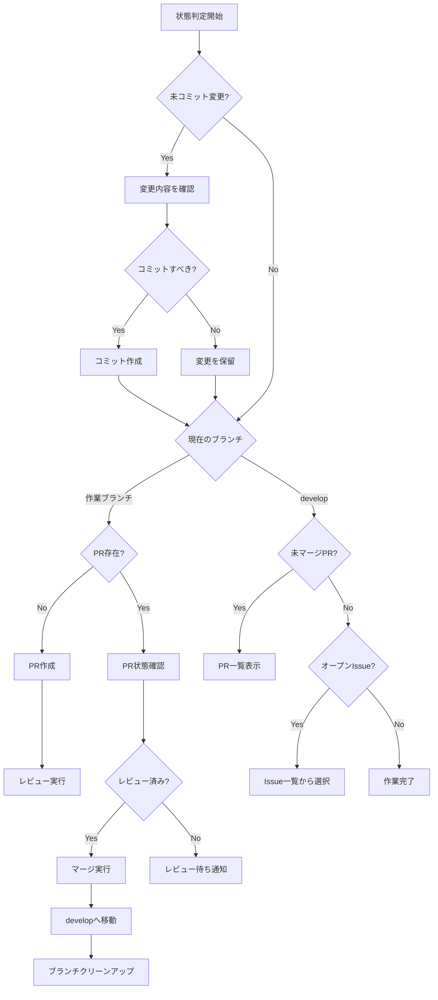

# continue-work

現在のリポジトリ状態を判定し、適切なワークフローに乗せて作業を継続するコマンド。

## Usage

```
/continue-work [--auto]
```

## Options

- `--auto`: 自律モード。ユーザー確認をスキップし、自動的に作業を進める

## Description

このコマンドは以下の状態を判定し、適切なアクションを実行します：

### 判定フロー

1. **未コミットの変更がある場合**
   - 変更内容を確認
   - コミットするかどうか判断
   - 必要に応じてコミット作成

2. **作業ブランチにいる場合（develop以外）**
   - PRが既に存在するか確認
   - PRがない場合：PR作成を提案
   - PRがある場合：PRの状態を確認（レビュー待ち、修正要求など）

3. **developブランチにいる場合**
   - 未マージのPRがあるか確認
   - オープンなIssueがあるか確認
   - 次に取り組むべきタスクを提案

4. **マージ済みブランチがある場合**
   - ブランチのクリーンアップを提案

### 自律モード（--auto）

`--auto`オプションを指定すると：
- 明確なアクションがある場合は自動実行
- コミット、PR作成、マージを自動で行う
- 判断が必要な場合のみユーザーに確認

## Workflow



## Examples

### 基本使用

```
/continue-work
```

状態を判定して次のアクションを提案します。

### 自律モード

```
/continue-work --auto
```

可能な限り自動で作業を進めます。

## Implementation

1. `git status`で未コミット変更を確認
2. `git branch --show-current`で現在のブランチを確認
3. `gh pr list`でPR状態を確認
4. `gh issue list`でIssue状態を確認
5. 状態に応じたアクションを実行

## Notes

- CLAUDE.mdのワークフローに従って作業を進める
- developへの直接コミットは避ける
- レビュー指摘がブランチ範囲外の場合はIssueを作成
